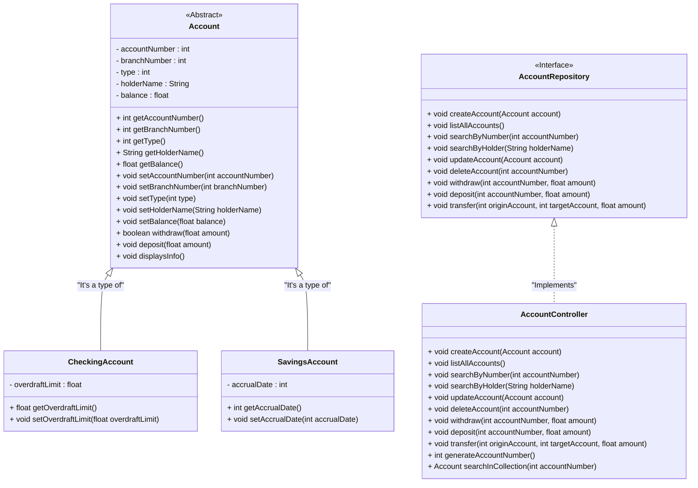

<div align="center">
  
</div>

<br />

<h1 align="center">Java Bank Account Project</h1>

<br />

<div align="center">
  
  
  
  
  
  
</div>

------

<br />

## 1. Description

<br />

The **Bank Account Project** is a management system designed to simulate and manage financial transactions related to bank accounts. It offers features such as account registration, consultation, updating, and deletion, as well as transactions such as deposits, withdrawals, and transfers.

The system organizes customer information—including account holder name, account number, balance, and account type—ensuring secure transactions. Its main objective is to automate and simplify the management of bank accounts, such as checking accounts and savings accounts, promoting agility and accuracy in financial control.

This project, developed in **Java**, focuses on the study and application of **Object-Oriented Programming (OOP)** concepts, including:

- Classes and Objects;
- Attributes and Methods;
- Access Modifiers;
- Inheritance and Polymorphism;
- Abstract Classes;
- Interfaces.

In addition to serving as a functional simulator, the project offers a practical basis for understanding the fundamental principles of OOP applied to a realistic scenario.

<br />

## 2. Project Functionalities

<br />

1. **Create a New Account:** Creates a new bank account by specifying the branch number, specific properties based on the account type, account holder's name, and initial balance. The account number is automatically generated;

2. **List All Accounts:** Lists all accounts registered in the system;

3. **Search Account by Number:** Finds an account using its account number;

4. **Search Account by Holder:** Finds one or more accounts associated with the account holder's name;

5. **Update Account Data:** Allows for updating the details of an existing account based on the account number;

6. **Delete Account:** Removes a specific account based on the account number;

7. **Withdraw:** Performs a withdrawal of an amount from an account, provided the balance is sufficient;

8. **Deposit:** Adds an amount to the balance of an existing account;

9. **Transfer:** Transfers an amount from one account to another, respecting the respective balances and limits.

<br />

## 3. Class Diagram

<br />

A **Class Diagram** is a visual model used in object-oriented programming to represent the structure of a system. It displays classes, attributes, methods, and the relationships between them, such as associations, inheritance, and dependencies.

This diagram helps in planning and understanding the system's architecture, showing how the components interact and connect. It is widely used during the design and documentation phases of projects.

Below, you can see the Class Diagram for the Banking Account Project:



<br />

The project will be structured with the following **Classes** and **Interfaces**, each with clearly defined responsibilities:

| Class/Interface     | Description                                                    |
| ------------------- | ------------------------------------------------------------ |
| **BankAccountApp**  | The application's main class. It contains the `main` method and is responsible for displaying the initial menu with all system functionalities. |
| **Colors**           | A utility class used to apply colors to the menu, improving the visual experience in the terminal. |
| **Account**           | The base class that defines the generic structure of a bank account. |
| **CheckingAccount**   | A class that extends `Account` and represents a checking account, with its specific features. |
| **SavingsAccount**   | A class that extends `Account` and represents a savings account, with its own functionalities. |
| **AccountRepository** | An interface that declares the methods to be implemented and used within the application's menu. |
| **AccountController** | A class that implements the `AccountRepository` interface, being responsible for the account manipulation logic. |

<br />

## 4. System Home Screen - Menu

<br />

<div align="center">
   
</div>

<br />

## 5. Requirements

<br />

To run the code locally, you will need:

- [Java JDK 21+](https://www.oracle.com/java/technologies/downloads/#jdk21)
- [Eclipse](https://eclipseide.org/) or [Spring Tool Suite (STS)](https://spring.io/tools)

<br />

## 6. How to Run Projects in Eclipse/STS

<br />

### 6.1. Importing the Project

1. Clone the repository [generation-bank-account-java](https://github.com/alanbrunoscience/generation-bank-account-java) inside your Eclipse/STS *Workspace* folder:

```bash
git clone git@github.com:alanbrunoscience/generation-bank-account-java.git
```

2. **Open Eclipse/STS** and select the *Workspace* folder where you cloned the repository.  
3. In the top menu of Eclipse/STS, click: **File 🡲 Import...**  
4. In the **Import** window, select: **General 🡲 Existing Projects into Workspace** and click **Next**.  
5. In the **Import Projects** window, under **Select root directory**, click **Browse...** and select the Workspace folder where you cloned the repository.  
6. Eclipse/STS will automatically recognize all the projects.  
7. Check all the projects you want to import under **Projects** and click **Finish** to complete the import.  

<br />

### 6.2. Running a Java Project

1. In the **Package Explorer** tab, locate the project.  
2. Open the class you want to run.  
3. Click the **Run** button  to execute the application.  
4. If prompted for the project type, select **Java Application**.  
5. The console will display the output of the application.

<br />

## 7. Contributions

<br />

This repository is part of an educational project; however, contributions are always welcome.  
If you have suggestions, corrections, or improvements, feel free to:

<br />

- Open an **issue**;
- Submit a **pull request**;
- Share with colleagues who are learning Java!  

<br />

##  8. Contact

<br />

Developed by [**Alan Bruno**](https://github.com/alanbrunoscience)®

For questions, suggestions, or collaborations, feel free to reach out via:  
- 🌐 [GitHub Issues](../../issues)
